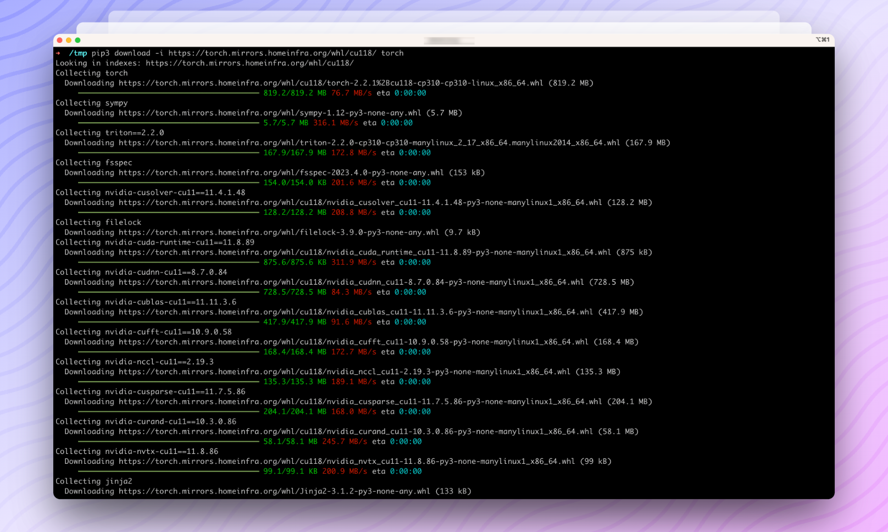

[中文](README.md) | English 

# LightMirrors

LightMirrors is a lightweight mirror server with caching capabilities that currently supports DockerHub, PyPI, PyTorch, and NPM.

**We only provide support for Chinese users currently. Please kindly submit an issue if you need English documents.**

Any pull requests and issues are welcome. This project is currently in its very early stages, and we greatly appreciate your valuable feedback and suggestions.

---

TBD